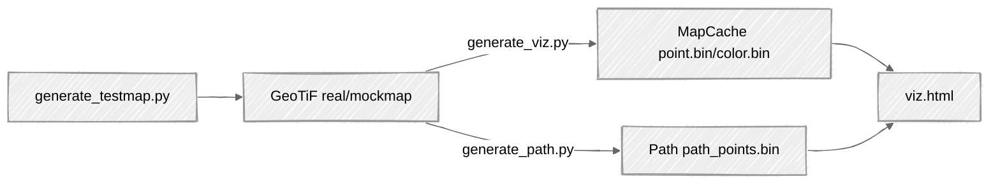

# Robot 2.5D/3D Path Search

[Demo website](https://tingfan.github.io/geo/viz.html)


## Design Decisions
* Use [pixi](https://github.com/tingfan/pixi) to manage python packages, this build on conda save the resolved packages in a lock file so which increase reproductibility and speed.
* Use [d3](https://github.com/d3/d3) as a light-weight html only visualizer. I've tried rerun, but found it diffiult to create flexible user-interface and slower rendering speed for large scale point cloud
* Independent python CLIs that can be used indepedently from the web visualizer

## Deliverables


## Algorithm
1. 2D Voxelization
    * Use median filter to remove depth noise
    * Save a voxel grid as a numpy array
1. 2D short-test path search algorithm
    * Use Dijkstra's algorithm to find the shortest path. 
        * 4-connectivity + neighbor voxel with in given height difference limit (cosider robot step height)
        * cost - step + weight * height difference, tradeoff between 2d-distance and height difference

## Setup
```
git clone git@github.com:tingfan/geo.git
cd geo
[optionally] download msn-GD7KCzDIxA_VEGETATION_DEM.tif into data folder.
pixi run test_all.py 
python -m http.server
```
Open browser and navigate to http://localhost:8000
An online version (test data only) can be found at https://tingfan.github.io/geo/viz.html


## Tasks
- [X] Simple 2D path search for ground drone/robotdog navigation.
- [ ] 2.5D path search for navigation above ground (allow drone flight with AGL or MSL fly rule or robot dog walking on reachable ground)
    - [X] 2D terrain map
    - [ ] 2D flight height limit map
    - [ ] 3D path search with flight heigh cost 
- [ ] 3D voxelization / 3D path search -- allowing robot to explore true 3D space, such as tunnel or building.
